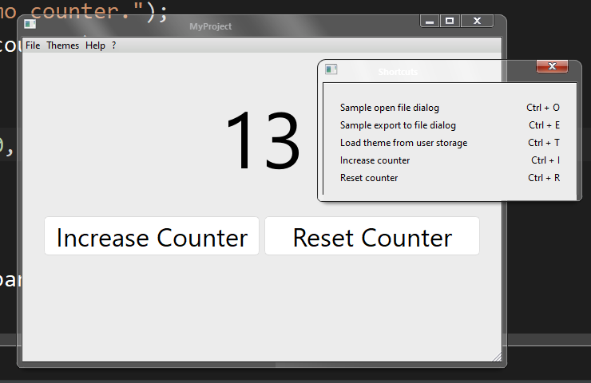
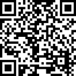

# MyProject
#### Description Here Lorem Ipsum Dolor Sit Amet

 

This is how you include readme resources : \
``

 

And this is how the template looks like by default :

 

It includes a theming system, a codebase, runtime UI documentation, Unit Tests,
sample Open / Export file explorer dialogs, an About window, a Shortcuts window,
7 built-in themes, and an installer (custom NSIS script generator). \
Themes are included using Qt's CMake resource system,
along with a complete cmake code structure. \
Unit Tests are set up using CTest, CMake's unit testing framework.

 

---

#### Build Instructions
Requirements :
- CMake v3.27+
- Qt6's mingw-w64 binaries v11.2.0+

Instructions :
- Generate the project for your favorite IDE
- Set the binaries folder to ``./bin/``
- Build

---

### Donations (replace the QR / links with yours)

<i>
    <h3 align="center" style="margin-top: 0px; padding-top: 0px">
        PayPal
    </h3>
</i>

    <a href="https://www.paypal.com/cgi-bin/webscr?cmd=_s-xclick&hosted_button_id=E4MPSYVCAYYSS">
        <image 
            src="https://www.paypalobjects.com/en_US/FR/i/btn/btn_donateCC_LG.gif" 
            border="0"
            name="submit"
            title="PayPal - The safer, easier way to pay online!" 
            alt="Donate with PayPal button" 
        />
    </a>

    

